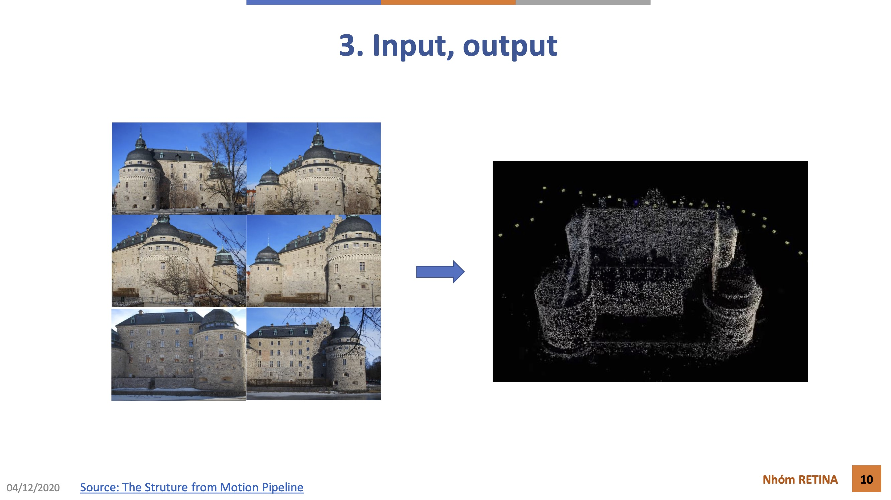
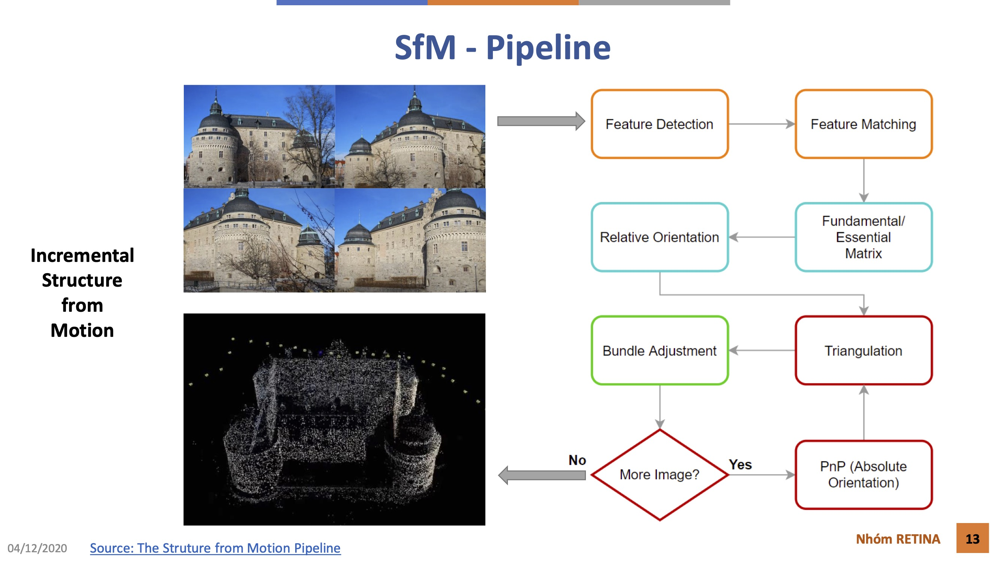
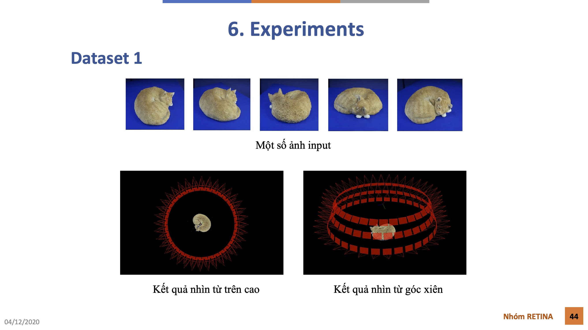
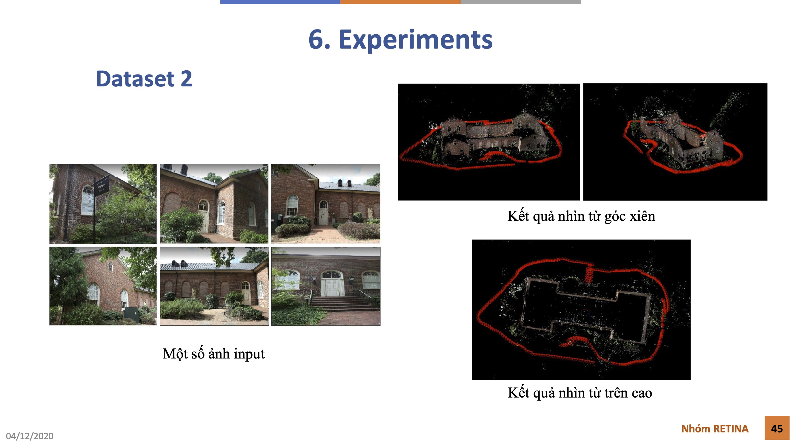

# XLA-DIP-Final-Project

## Overview

Final project in Digital Image and Video Processing. Reseach on the topic of Photogrammetry and Structure from Motion (SfM) method in Computer Vision. SfM is used to reconstruct 3D point cloud from a list of 2D images that capture objects or scene from multiple viewpoints

## Input, Output

## Structure from Motion Pipeline

## Experiments

## References
1. [Structure-From-Motion Revisited (2016)](https://paperswithcode.com/paper/structure-from-motion-revisited)
2. [3D Point Cloud Generation Using Incremental Structure-from-Motion (2018)](https://www.researchgate.net/publication/328033997_3D_Point_Cloud_Generation_Using_Incremental_Structure-from-Motion)
3. [Fast incremental structure from motion based on parallel bundle adjustment (2020)](https://link.springer.com/article/10.1007/s11554-020-00970-3) 
4. [Computer Vision, Algorithms and Appications (2010)](https://szeliski.org/Book/drafts/SzeliskiBook_20100903_draft.pdf)
5. [Photogrammetric Computer Vision (2016)](https://link.springer.com/book/10.1007/978-3-319-11550-4)
6. [Photogrammetry Computer Vision (2020)](https://www.youtube.com/playlist?list=PLgnQpQtFTOGTPQhKBOGgjTgX-mzpsOGOX)
7. [Photogrammetry II (2020)](https://www.youtube.com/playlist?list=PLgnQpQtFTOGQEXN2Qo571uvwIGNGAM8uf)

## Member information

|#|Name|
|---|---|
|1|Bùi Đoàn Hữu Nhân|
|2|Nguyễn Tấn Thìn|
|3|Phạm Nguyên Minh Thy|
|4|Đinh Hữu Phúc Trung|
|5|Nguyễn Phạm Phúc Việt|
